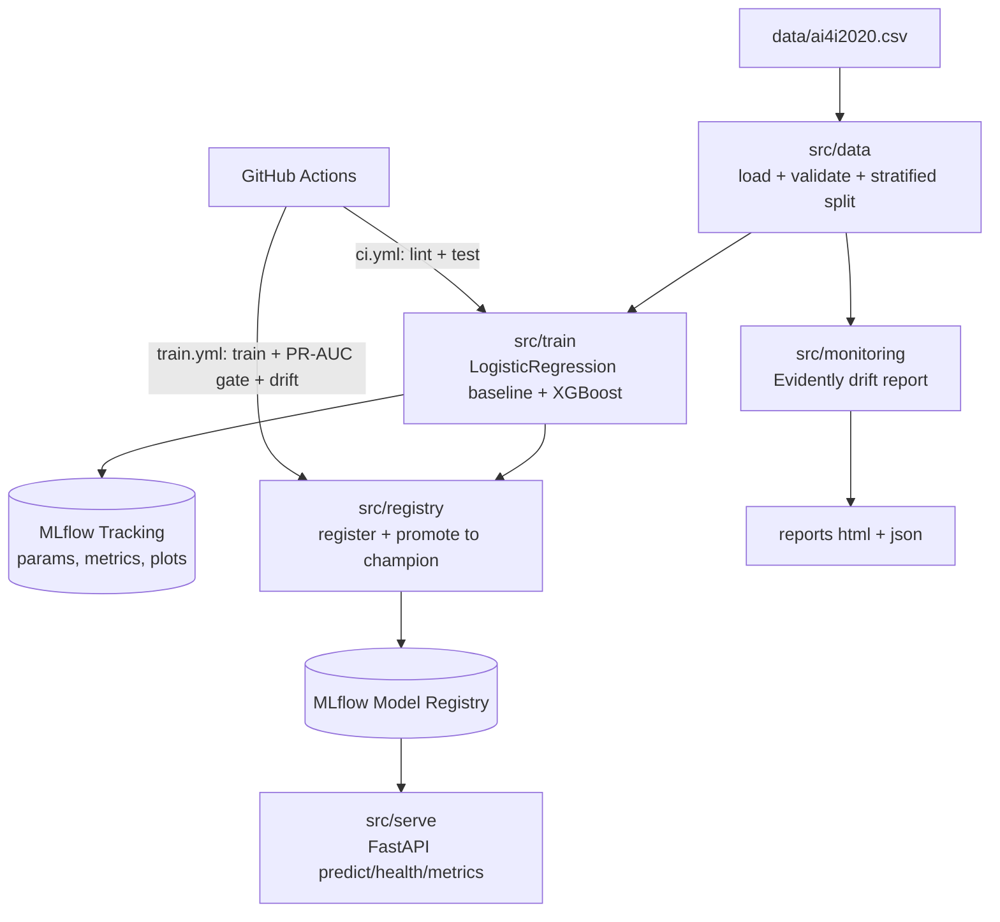

# anomaly-detection-mlops

[](https://github.com/abhi-faldu/anomaly-detection-MLops/actions/workflows/ci.yml)


> Production-style **MLOps pipeline** for predictive maintenance — train, track, register, serve, and monitor a failure-classification model on the **AI4I 2020** dataset.

Third project in a 3-part Industry 4.0 portfolio:

1. [robotic-bearing-pdm](https://github.com/abhi-faldu/robotic-bearing-pdm) — LSTM autoencoder anomaly detection (NASA IMS bearings)
2. [iiot-smart-factory-sim](https://github.com/abhi-faldu/iiot-smart-factory-sim) — MQTT IIoT simulator + real-time Z-score detection
3. **anomaly-detection-mlops** — the MLOps layer (this repo)

The focus here is **MLOps engineering**, not model novelty: reproducible training, experiment tracking, model-registry promotion, drift monitoring, testing, and CI/CD automation. The model is a solid gradient-boosted classifier; the value is in everything around it.

## Architecture



## Stack

| Layer | Technology |
|---|---|
| Modeling | scikit-learn (LogisticRegression baseline) + XGBoost (main) |
| Experiment tracking & registry | MLflow 3 (SQLite backend, local artifacts; `champion` alias) |
| Drift / data quality | Evidently 0.7 |
| Serving | FastAPI + Uvicorn |
| Testing | pytest + pytest-cov (38 tests, ~90% coverage) |
| CI/CD | GitHub Actions |
| Containerisation | Docker + Docker Compose |

## Results

| Model | PR-AUC | ROC-AUC | Recall | Precision |
|---|---|---|---|---|
| LogisticRegression (baseline) | 0.382 | 0.907 | 0.824 | 0.142 |
| **XGBoost** (champion) | **0.828** | **0.968** | 0.779 | 0.697 |

PR-AUC is the headline metric — the target is only ~3.4% positive, so accuracy
and ROC-AUC are misleading. Full analysis in [FINDINGS.md](FINDINGS.md).

## Dataset — AI4I 2020 Predictive Maintenance

~10,000 rows of tabular sensor data; binary `Machine failure` target. The
per-cause flags (`TWF/HDF/PWF/OSF/RNF`) and IDs are dropped as leakage — only
the five sensor numerics and machine `Type` are used.

The dataset is **gitignored**. Get it one of two ways and save as `data/ai4i2020.csv`:

```bash
# Kaggle
kaggle datasets download stephanmatzka/predictive-maintenance-dataset-ai4i-2020

# or UCI (no auth)
curl -sL -o ai4i.zip "https://archive.ics.uci.edu/static/public/601/ai4i+2020+predictive+maintenance+dataset.zip"
unzip ai4i.zip -d data
```

## Quickstart (local)

```bash
python -m venv .venv
.venv\Scripts\activate            # Windows  (source .venv/bin/activate on Linux/macOS)
pip install -r requirements-dev.txt

python -m src.train.train          # train both models, log to MLflow
python -m src.registry.promote     # register + promote best to @champion
python -m mlflow ui --backend-store-uri sqlite:///mlflow.db   # browse runs at :5000
python -m uvicorn src.serve.main:app --port 8000              # API at :8000/docs
python -m src.monitoring.drift_report                         # Evidently report → reports/
pytest                              # tests + coverage
```

A `Makefile` wraps these as `make train|serve|drift|mlflow|test`.

### Predict

```bash
curl -X POST http://localhost:8000/predict -H "Content-Type: application/json" -d '{
  "air_temperature_k": 302.0, "process_temperature_k": 311.0,
  "rotational_speed_rpm": 1300, "torque_nm": 65.0,
  "tool_wear_min": 220, "type": "L"
}'
# {"failure_probability": 0.9998, "prediction": 1, "threshold": 0.5, "model_version": "1"}
```

## Quickstart (Docker)

Brings up the MLflow tracking server and the prediction API:

```bash
docker compose up --build -d

# Train against the running server so artifacts are stored portably:
MLFLOW_TRACKING_URI=http://localhost:5000 python -m src.pipeline
docker compose restart api          # API picks up the new champion

curl http://localhost:8000/health   # {"status":"ok","model_loaded":true,...}
```

MLflow UI → http://localhost:5000, API docs → http://localhost:8000/docs.

## Model registry workflow

MLflow 3 deprecates registry *stages* in favour of *aliases*. Training registers
a new version tagged with its PR-AUC; promotion compares the candidate against
the current `champion` and reassigns the alias only if the candidate is at least
as good. The API loads `models:/ai4i-failure-classifier@champion` at startup.

## CI/CD

- **`ci.yml`** — on every push/PR: downloads the dataset, runs `ruff` lint and the full pytest suite with coverage.
- **`train.yml`** — manual (`workflow_dispatch`) + weekly cron: trains, enforces the **PR-AUC ≥ 0.75 gate** (fails the build otherwise), promotes the best model, generates the drift report, and uploads the MLflow store + reports as artifacts.

## Project layout

```
src/
  config.py            env-driven settings (pydantic-settings)
  data/                load + schema validation, preprocessing pipeline
  train/               training (MLflow logging) + evaluation metrics/plots
  registry/            register + champion-alias promotion
  serve/               FastAPI prediction service
  monitoring/          Evidently drift report
  pipeline.py          gated train→promote entrypoint for CI
tests/                 38 tests (unit + integration)
.github/workflows/     ci.yml, train.yml
Dockerfile.api  Dockerfile.mlflow  docker-compose.yml
```

## Configuration

All settings are environment-driven — see [.env.example](.env.example). Key
knobs: `MLFLOW_TRACKING_URI`, `MLFLOW_REGISTERED_MODEL_NAME`, `PR_AUC_FLOOR`.

**Upgrade path:** v1 uses SQLite + local artifacts for simplicity. For a more
production-grade setup, point `MLFLOW_TRACKING_URI` at a remote server backed by
PostgreSQL + S3/MinIO — no application code changes required.

## License

MIT
