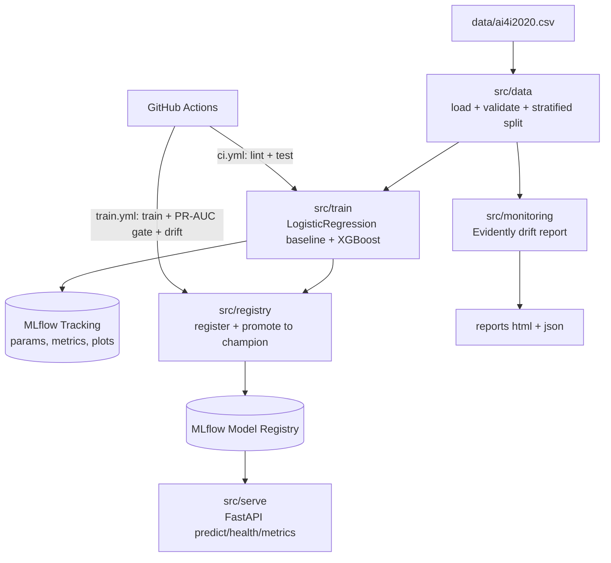

<div style="text-align:center">

<h1 align="center">🔁 anomaly-detection-mlops</h1>

**Production-style MLOps pipeline for predictive maintenance**  
**train · track · register · serve · monitor — with MLflow, FastAPI, Evidently, and GitHub Actions CI/CD**

[](https://github.com/abhi-faldu/anomaly-detection-MLops/actions/workflows/ci.yml)
[](LICENSE)
[](https://python.org)
[](https://mlflow.org)
[](https://scikit-learn.org)
[](https://xgboost.readthedocs.io)
[](https://fastapi.tiangolo.com)
[](https://evidentlyai.com)
[](https://docker.com)

[Quick Start](#-quickstart) · [Architecture](#-architecture) · [Model](#-model--training) · [API](#-api-usage) · [Dashboards](#-dashboards) · [Docker](#-docker) · [CI/CD](#-cicd)

</div>

---

## Problem 🏭

The first two projects in this portfolio **detect** machine faults. This one answers the harder question every automotive plant faces once a model exists: **how do you run it like a product?**

A predictive-maintenance model that lives in a notebook is worthless on the factory floor. It has to be reproducibly trained, version-tracked, promoted only when it beats the incumbent, served behind a stable API, watched for data drift, and gated by automated tests before anything ships. That discipline — not the model itself — is what separates a demo from production.

This project builds that full **MLOps loop** around a failure classifier on the **AI4I 2020** dataset: train a baseline and a gradient-boosted model, track every run in MLflow, promote the best to a `champion` alias in the registry, serve it via FastAPI, monitor drift with Evidently, and gate the whole thing through GitHub Actions — all containerised.

---

## What This Project Does 🎯

| Step | Description |
|------|-------------|
| **Train** | LogisticRegression baseline + XGBoost on a stratified split, with class-imbalance handling for the ~3.4% failure rate |
| **Track** | Every run logged to MLflow — params, PR-AUC/ROC-AUC metrics, PR-curve + confusion-matrix plots |
| **Register** | Best run registered to the MLflow Model Registry, tagged with its PR-AUC |
| **Promote** | Candidate compared against the current `champion` alias; alias reassigned only if it wins |
| **Serve** | FastAPI loads `models:/...@champion` at startup — `/predict`, `/health`, `/metrics` |
| **Monitor** | Evidently compares reference vs current data → drift report (HTML) + JSON summary |
| **Gate** | CI enforces a PR-AUC ≥ 0.75 floor; a regression fails the build before promotion |
| **Deploy** | Docker Compose — MLflow server + prediction API, one command |

---

## Project Structure 🗂️

```text
anomaly-detection-mlops/
├── src/
│   ├── config.py                   ← env-driven settings (pydantic-settings)
│   ├── data/
│   │   ├── load.py                 ← CSV load + schema validation (UTF-8 BOM safe)
│   │   └── preprocess.py           ← ColumnTransformer, stratified split, leakage guard
│   ├── train/
│   │   ├── train.py                ← train baseline + XGBoost, log to MLflow
│   │   └── evaluate.py             ← PR-AUC/ROC-AUC metrics, PR-curve + confusion plots
│   ├── registry/
│   │   └── promote.py              ← register + promote best model to @champion
│   ├── serve/
│   │   └── main.py                 ← FastAPI prediction service
│   ├── monitoring/
│   │   └── drift_report.py         ← Evidently drift report → HTML + JSON
│   └── pipeline.py                 ← gated train→promote entrypoint for CI
├── tests/                          ← 38 tests, ~90% coverage (unit + integration)
├── .github/workflows/
│   ├── ci.yml                      ← lint + test on every push/PR
│   └── train.yml                   ← scheduled train + PR-AUC gate + drift report
├── Dockerfile.api                  ← FastAPI service image
├── Dockerfile.mlflow               ← MLflow tracking server image
├── docker-compose.yml              ← mlflow server + api
├── Makefile                        ← make train | serve | drift | mlflow | test
├── requirements.txt                ← pinned runtime deps
├── requirements-dev.txt            ← + pytest, ruff, httpx
└── FINDINGS.md                     ← model comparison + drift analysis
```

---

## Architecture 🔌



### Components

| Component | Technology | Role |
|---|---|---|
| mlflow | custom python:3.12-slim | Tracking server + Model Registry (SQLite + local artifacts), port 5000 |
| api | custom python:3.12-slim | FastAPI prediction service loading `@champion`, port 8000 |
| training | scikit-learn + XGBoost | Baseline + main model, logged to MLflow |
| monitoring | Evidently 0.7 | Data-drift + quality report |
| ci/cd | GitHub Actions | Lint, test, train-gate, drift, artifact upload |

---

## Dataset & Features 📑

**AI4I 2020 Predictive Maintenance** — ~10,000 rows of tabular sensor data; binary `Machine failure` target at a **~3.39% positive rate** (heavy class imbalance).

| Feature | Type | Notes |
|---|---|---|
| Air temperature [K] | numeric | standard-scaled |
| Process temperature [K] | numeric | standard-scaled |
| Rotational speed [rpm] | numeric | standard-scaled |
| Torque [Nm] | numeric | standard-scaled |
| Tool wear [min] | numeric | standard-scaled |
| Type (L/M/H) | categorical | one-hot encoded |

**Leakage guard:** the per-cause failure flags (`TWF`, `HDF`, `PWF`, `OSF`, `RNF`) are *downstream of the target* and the IDs (`UDI`, `Product ID`) carry no signal — all are **dropped** from the feature matrix.

The dataset is **gitignored**. Fetch it and save as `data/ai4i2020.csv`:

```bash
# Kaggle
kaggle datasets download stephanmatzka/predictive-maintenance-dataset-ai4i-2020

# or UCI (no auth — what CI uses)
curl -sL -o ai4i.zip "https://archive.ics.uci.edu/static/public/601/ai4i+2020+predictive+maintenance+dataset.zip"
unzip ai4i.zip -d data
```

---

## Model & Training 🧠

Two models are trained on an 80/20 stratified split (fixed seed 42). **PR-AUC is the headline metric** — at ~3.4% positives, accuracy and ROC-AUC flatter a classifier, while PR-AUC tells the truth about precision/recall on the rare failure class.

| Model | PR-AUC | ROC-AUC | Recall | Precision |
|---|---|---|---|---|
| LogisticRegression (baseline, balanced) | 0.382 | 0.907 | 0.824 | 0.142 |
| **XGBoost** (scale_pos_weight) → `champion` | **0.828** | **0.968** | 0.779 | 0.697 |

The baseline's 0.907 ROC-AUC looks fine until PR-AUC exposes **14% precision** — ~6 false alarms per true catch. XGBoost more than doubles PR-AUC and lifts precision to **0.70** at comparable recall. Class imbalance is handled without resampling (`class_weight="balanced"` / `scale_pos_weight = n_neg/n_pos`). Full write-up in [FINDINGS.md](FINDINGS.md).

```bash
python -m src.train.train          # train both, print the table above, log to MLflow
python -m src.registry.promote     # register best + promote to @champion
```

### Model registry — aliases, not stages

MLflow 3 deprecates registry *stages* in favour of *aliases*. Each new version is tagged with its PR-AUC; promotion compares the candidate against the current `champion` and reassigns the alias **only if the candidate is at least as good**. The API always loads `models:/ai4i-failure-classifier@champion`.

---

## Quickstart 🚀

### Option A — Full Docker Stack (recommended)

```bash
git clone https://github.com/abhi-faldu/anomaly-detection-MLops.git
cd anomaly-detection-MLops
docker compose up --build -d

# Train against the running server so artifacts are stored portably:
MLFLOW_TRACKING_URI=http://localhost:5000 python -m src.pipeline
docker compose restart api          # API picks up the new champion
```

| Service | URL |
|---|---|
| Prediction API | http://localhost:8000 |
| FastAPI docs | http://localhost:8000/docs |
| MLflow UI | http://localhost:5000 |

### Option B — Local Python (for development)

```bash
python -m venv .venv
.venv\Scripts\activate              # Windows  (source .venv/bin/activate on Linux/macOS)
pip install -r requirements-dev.txt

python -m src.train.train           # train + log to MLflow
python -m src.registry.promote      # register + promote to @champion
python -m mlflow ui --backend-store-uri sqlite:///mlflow.db   # UI at :5000
python -m uvicorn src.serve.main:app --port 8000              # API at :8000/docs
python -m src.monitoring.drift_report                         # drift report → reports/
```

A `Makefile` wraps these as `make train | serve | drift | mlflow | test`.

### Option C — CI / dataset download

GitHub Actions downloads the dataset from UCI automatically. To reproduce CI locally:

```bash
pip install -r requirements-dev.txt
# download dataset (see Dataset & Features)
ruff check src tests
pytest                              # 38 tests, ~90% coverage
```

---

## API Usage 🌐

```bash
# Predict failure probability for one machine reading
curl -X POST http://localhost:8000/predict -H "Content-Type: application/json" -d '{
  "air_temperature_k": 302.0, "process_temperature_k": 311.0,
  "rotational_speed_rpm": 1300, "torque_nm": 65.0,
  "tool_wear_min": 220, "type": "L"
}'

# Health (reports whether a champion model is loaded)
curl http://localhost:8000/health

# Model + serving metadata
curl http://localhost:8000/metrics
```

**`/predict` response:**

```json
{
  "failure_probability": 0.9998,
  "prediction": 1,
  "threshold": 0.5,
  "model_version": "1"
}
```

**`/health` response:**

```json
{ "status": "ok", "model_loaded": true, "model_version": "1" }
```

---

## Dashboards 📊

This project doesn't ship a bespoke web dashboard — it relies on two purpose-built MLOps surfaces:

### MLflow UI (http://localhost:5000)

The experiment-tracking and registry dashboard. Compare every run side by side (PR-AUC, ROC-AUC, params), open logged artifacts (PR curve, confusion matrix), and inspect the Model Registry — versions, PR-AUC tags, and which one currently holds the `champion` alias.

```bash
python -m mlflow ui --backend-store-uri sqlite:///mlflow.db   # local
# or http://localhost:5000 when running via docker compose
```

### Evidently Drift Report (reports/drift_report.html)

A self-contained HTML report generated by `src/monitoring/drift_report.py`: per-column drift, distribution overlays (reference vs current), and a data-quality summary. A compact `reports/drift_summary.json` carries the single `dataset_drift` boolean the CI/monitoring job gates on.

```bash
python -m src.monitoring.drift_report   # writes reports/drift_report.html + drift_summary.json
```

> In the bundled demo (`simulate_drift` injects covariate shift), the report flags **3 of 6 columns drifted** (both temperatures + tool wear) → `dataset_drift: true`, while unaffected columns correctly show none.

---

## Docker 🐳

```bash
# Full stack (MLflow server + API)
docker compose up --build -d

# Train against the containerised server, then refresh the API
MLFLOW_TRACKING_URI=http://localhost:5000 python -m src.pipeline
docker compose restart api

# Individual services
docker compose up mlflow            # tracking server + registry only

# Stop and clean up
docker compose down
docker compose down -v              # also removes the mlflow data volume
```

> The MLflow service sets `MLFLOW_SERVER_ALLOWED_HOSTS` so the API container can reach it through MLflow 3's DNS-rebinding protection.

---

## CI/CD ⚙️

| Workflow | Trigger | Does |
|---|---|---|
| **ci.yml** | every push / PR | downloads dataset → `ruff` lint → full pytest suite with coverage |
| **train.yml** | manual + weekly cron | trains → enforces **PR-AUC ≥ 0.75 gate** (fails build otherwise) → promotes best → drift report → uploads MLflow store + reports as artifacts |

---

## Tech Stack 🛠️

| Layer | Technology |
|---|---|
| Modeling | scikit-learn (LogisticRegression) + XGBoost |
| Experiment tracking & registry | MLflow 3 (SQLite backend, local artifacts, `champion` alias) |
| Drift / data quality | Evidently 0.7 |
| Serving | FastAPI 0.136 + Uvicorn |
| Config | pydantic-settings (env-driven) |
| Testing | pytest + pytest-cov (38 tests, ~90% coverage) |
| Linting | ruff |
| CI/CD | GitHub Actions |
| Containerisation | Docker, Docker Compose |
| Dataset | AI4I 2020 Predictive Maintenance (Kaggle / UCI) |

---

**Upgrade path:** v1 uses SQLite + local artifacts for simplicity. For a more production-grade setup, point `MLFLOW_TRACKING_URI` at a remote server backed by PostgreSQL + S3/MinIO — no application code changes required.

## License

MIT
